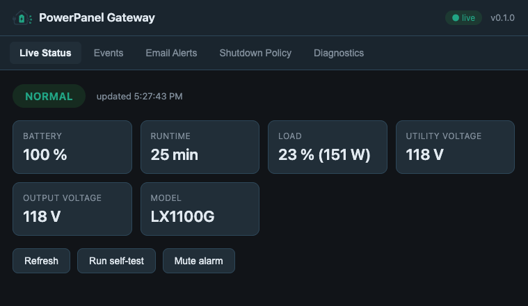

# powerpanel-gateway

A CyberPower PowerPanel-native **gateway** for monitoring and managing a
CyberPower UPS connected to your Home Assistant host over USB.

It wraps CyberPower PowerPanel's `pwrstat` command (or a built-in mock), exposes
a **typed REST API + event stream**, ships a **Home Assistant add-on** with an
Ingress web UI, and provides a polished **Home Assistant custom integration**
with sensors, binary sensors, buttons, switches, services, events, diagnostics
and repairs.

> Status: early (0.1.0). Local-only, no cloud. Host shutdown is **off by default**.


*(Screenshots are placeholders — see `docs/images/`.)*

---

## Architecture

```
CyberPower UPS (USB)
   → CyberPower PowerPanel / pwrstat
      → powerpanel-gateway backend (FastAPI)
         → REST API + SSE event stream + web UI (Ingress)
            → Home Assistant custom integration
               → sensors, binary sensors, buttons, switches, events, services
```

The backend normalizes raw `pwrstat` output into a **stable JSON schema**, keeps
a rolling **event log** (SQLite), can send **email alerts**, and evaluates a
**shutdown policy** (dry-run by default). The integration polls the API, mirrors
state into entities, and re-fires gateway events on the Home Assistant bus.

## Features

- 🔌 Reads UPS status from `pwrstat`; robust parser with tests over sample output
- 🧪 **Mock mode** — full functionality with no UPS (CI, demos, screenshots)
- 🌐 REST API + **SSE** stream; dependency-free web UI via **Ingress**
- 📨 SMTP **email alerts** with per-event toggles and cooldown (passwords never logged)
- 🛑 **Shutdown policy** — config-first, `dry_run=true` by default, never shuts down implicitly
- 🏠 HA integration: config flow, options flow, coordinator, diagnostics, repairs, translations
- 🧰 Typed end-to-end (`pydantic`, type hints), `ruff` + `mypy` + `pytest` clean

## Repository layout

```
addon-repository/            Home Assistant add-on (backend lives in rootfs/app)
  powerpanel_gateway/
    rootfs/app/powerpanel_gateway/   ← the importable Python package + web UI
custom_components/powerpanel_gateway/  Home Assistant custom integration
deploy/                      Standalone deploy kit (Debian image, compose, systemd)
tests/                       Backend + integration tests
examples/                    Automations, dashboard card, sample pwrstat output
docs/                        ASSUMPTIONS.md and images
```

The Python package has a single home (`addon-repository/.../rootfs/app/powerpanel_gateway`)
and is made importable for dev/tests via `pyproject.toml`.

---

## Deployment topologies

Pick based on **where the UPS is plugged in**:

| Your situation | Run the backend as | Install on Home Assistant |
| --- | --- | --- |
| UPS on the **Home Assistant host** | the **add-on** (below) | the integration |
| UPS on a **separate machine** (e.g. you run Home Assistant OS) | the **standalone deploy image / host service** on that machine — see [`deploy/README.md`](deploy/README.md) | the integration only, pointed at that machine's IP:8099 (set an API token) |
| Just trying it out | either, in **mock mode** | the integration (optional) |

> Note: the **add-on image is Alpine (musl)** and CyberPower PowerPanel ships
> **glibc** binaries, so real-UPS mode is best served by the **Debian-based deploy
> image** in `deploy/` (or a native host install). The add-on is ideal for mock
> mode and for the case where the UPS is on the HA host with a glibc-compatible
> PowerPanel.

## Install

### A) Home Assistant add-on (recommended)

1. **Settings → Add-ons → Add-on Store → ⋮ → Repositories**, add:
   `https://github.com/powerpanel-gateway/powerpanel-gateway`
2. Install **PowerPanel Gateway**, optionally enable **Mock mode**, start it,
   and click **Open Web UI**.
3. Real-UPS mode requires adding CyberPower PowerPanel to the image yourself
   (it is proprietary; see `addon-repository/powerpanel_gateway/DOCS.md`).

### B) Home Assistant integration via HACS

1. HACS → **Custom repositories** → add this repo as an **Integration**.
2. Install **PowerPanel Gateway**, restart Home Assistant.
3. **Settings → Devices & Services → Add Integration → PowerPanel Gateway**, and
   enter the gateway host/port (the add-on, or any host running the backend).

### C) Manual integration install

Copy `custom_components/powerpanel_gateway` into your HA `config/custom_components/`,
restart, then add the integration from the UI.

---

## Local development

```bash
python -m venv .venv
source .venv/bin/activate
pip install -e ".[dev]"
pytest
ruff check .
mypy .
```

Run the backend in mock mode:

```bash
POWERPANEL_GATEWAY_MOCK=1 uvicorn powerpanel_gateway.main:app \
  --host 0.0.0.0 --port 8099 --reload
# UI:   http://localhost:8099/
# API:  http://localhost:8099/api/status
# docs: http://localhost:8099/docs
```

Run the container in mock mode:

```bash
docker build -t powerpanel-gateway:dev ./addon-repository/powerpanel_gateway
docker run --rm -p 8099:8099 -e POWERPANEL_GATEWAY_MOCK=1 powerpanel-gateway:dev
# or: docker compose up gateway-mock
```

### Environment variables (backend)

| Variable | Default | Purpose |
| --- | --- | --- |
| `POWERPANEL_GATEWAY_MOCK` | `0` | `1` to use the simulated provider |
| `POWERPANEL_GATEWAY_DATA_DIR` | `/data` | Where `config.json` + `events.db` live |
| `POWERPANEL_GATEWAY_HOST` / `_PORT` | `0.0.0.0` / `8099` | Bind address |
| `POWERPANEL_GATEWAY_LOG_LEVEL` | `INFO` | Log verbosity |
| `POWERPANEL_GATEWAY_API_TOKEN` | _(empty)_ | Optional bearer token; empty disables auth |
| `POWERPANEL_GATEWAY_PWRSTAT_PATH` | `pwrstat` | Path to the `pwrstat` binary |

## REST API

| Method | Path | Description |
| --- | --- | --- |
| GET | `/health` | Liveness + version + mock flag (always open) |
| GET | `/api/status` | Normalized UPS status (stable schema) |
| GET | `/api/raw` | Last raw `pwrstat`/mock text |
| GET | `/api/events` | Event log (`?limit=`, `?type=`, `?since=`) |
| GET | `/api/config` / POST | Read / update mutable config (no secrets returned) |
| POST | `/api/actions/refresh` | Force a status refresh |
| POST | `/api/actions/self-test` | Start a UPS self-test |
| POST | `/api/actions/mute-alarm` | Mute the UPS alarm (if supported) |
| POST | `/api/actions/test-email` | Send a test email |
| POST | `/api/actions/simulate` | Drive the mock (`{"scenario": "..."}`) |
| GET | `/api/shutdown/evaluate` | What the shutdown policy would do now |
| GET | `/api/stream` | Server-sent events (status + new events) |
| GET | `/api/diagnostics` | Full secret-free diagnostics snapshot |

`GET /api/status` schema:

```json
{
  "ok": true, "state": "normal", "on_battery": false,
  "utility_power_present": true, "battery_percent": 100,
  "remaining_runtime_minutes": 42, "load_percent": 17, "load_watts": 86,
  "utility_voltage": 121.4, "output_voltage": 121.1, "battery_voltage": 13.6,
  "frequency_hz": 60.0, "model": "CyberPower CP1500PFCLCD",
  "serial_number": "unknown", "last_power_event": null,
  "last_self_test_result": "unknown", "raw_updated_at": "2026-06-02T10:30:00Z",
  "gateway_version": "0.1.0"
}
```

States: `normal`, `on_battery`, `low_battery`, `power_restored`, `self_test`,
`fault`, `communication_lost`, `unknown`.

## Home Assistant entities & events

- **Sensors:** state, battery %, runtime, load %/W, utility/output/battery
  voltage, frequency, last power event, last self-test result, estimated
  shutdown time.
- **Binary sensors:** on battery, low battery, utility power present, needs
  attention, communication OK.
- **Buttons:** refresh, run self-test, test email, export diagnostics.
- **Switches:** email alerts, shutdown policy.
- **Services:** `run_self_test`, `send_test_email`, `simulate`, `set_shutdown_policy`.
- **Bus events:** `powerpanel_gateway_power_failure`, `_power_restored`,
  `_low_battery`, `_communication_lost`, `_shutdown_pending`, `_self_test_failed`.

See `examples/automations.yaml` and `examples/dashboard-card.yaml`.

## Releasing

Releases are tag-driven. Maintainers:

```bash
# bump version in pyproject.toml, addon config.yaml, manifest.json, __init__.py
git tag v0.1.0
git push origin v0.1.0
```

`.github/workflows/release.yml` then runs tests, builds the Python package,
builds the add-on image for `amd64`/`aarch64`/`armv7`, and creates a GitHub
release with generated notes.

## Safety notes

- Host shutdown never runs unless `shutdown.enabled = true` **and**
  `shutdown.dry_run = false`. Defaults are `enabled=false`, `dry_run=true`.
- SMTP passwords are stored as secrets and are never written to logs or returned
  by the API.
- The gateway is local-only and requires no cloud services.
- We do **not** claim compatibility with every CyberPower UPS. A "tested
  devices" list will appear only once real-hardware reports exist. The fixtures
  here are derived from a `CP1500PFCLCD`.

## License & attribution

Licensed **GPL-3.0-or-later** (see [LICENSE](LICENSE)).

This project is **inspired by** two GPL-3.0 projects but is a clean-room
reimplementation rather than a copy of their code:

- [`sbruggeman/pwrstat-api`](https://github.com/sbruggeman/pwrstat-api) — the
  idea of wrapping `pwrstat` behind HTTP.
- [`twrecked/hass-pwrstat`](https://github.com/twrecked/hass-pwrstat) — the idea
  of a Home Assistant integration polling a `pwrstat-api` server.

Because both upstreams are GPL-3.0 and this project derives ideas (not code) from
them, we license under GPL-3.0-or-later and credit them here. If any code is ever
copied from those projects, the relevant license headers and change notes will be
added at the copied locations. CyberPower® and PowerPanel® are trademarks of
their owner; this project is not affiliated with or endorsed by CyberPower, and
does not redistribute PowerPanel.
